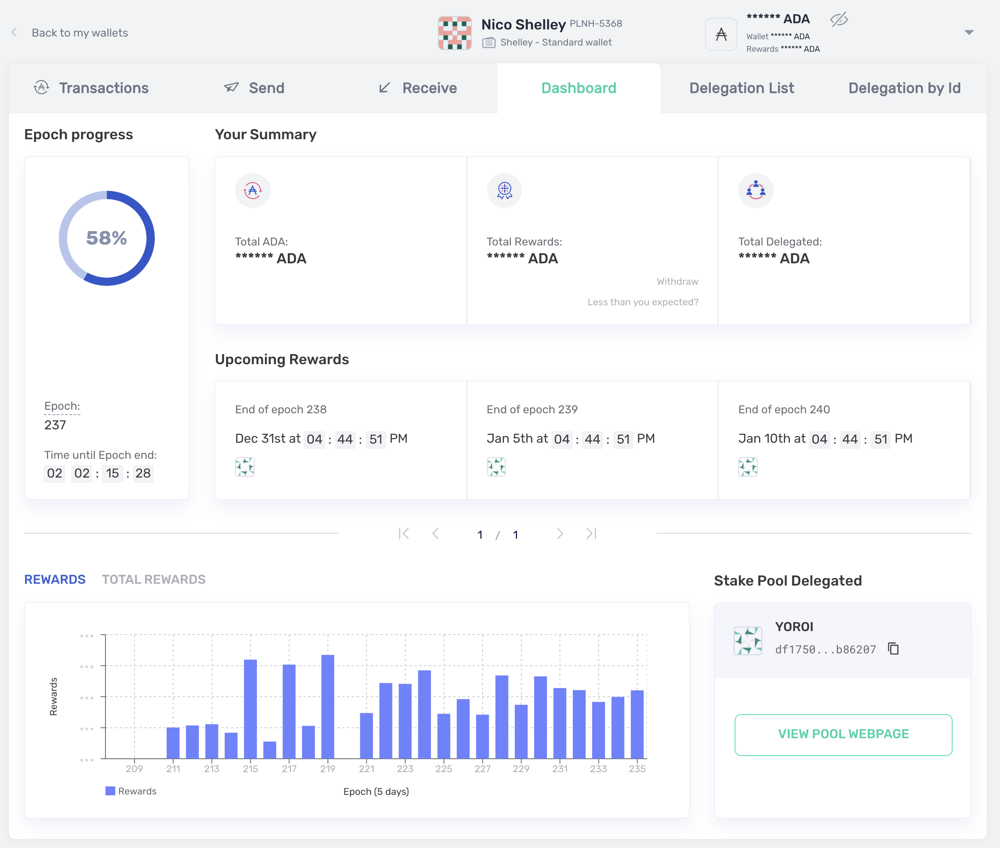
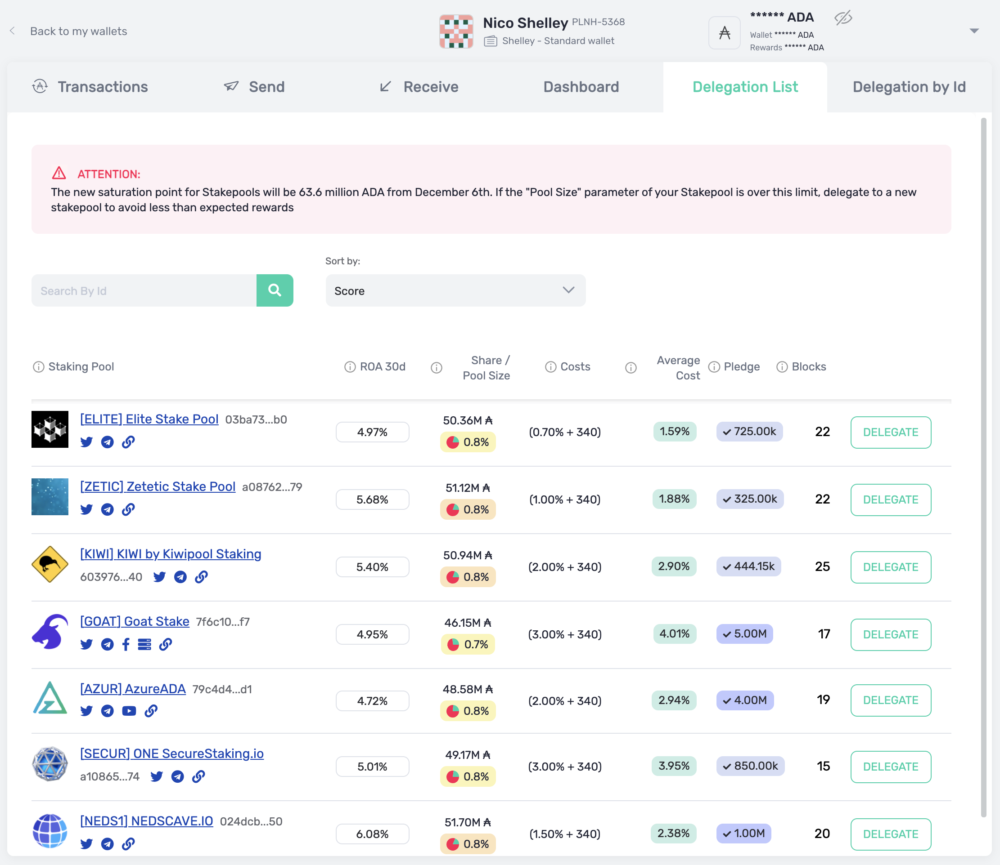

# Yoroi Usage

## How do I send and receive ADA using Yoroi?	

In order to receive Ada using Yoroi you first need to create your wallet in Yoroi. Be careful to store your 15-word recovery phrase for your wallet which you will get during the wallet creation process. This is very important, if you lose this you will likely lose your Ada.		

To receive Ada go to the Receive tab in your wallet and generate an address. Use a button in the user interface to copy it to the clipboard and then share it with the person who is going to send you Ada.		

To send Ada, obtain a Yoroi address from the person you are going to send Ada to and use the Send tab in your wallet to send the desired amount of Ada to that address.

## Once I have downloaded Yoroi, how long before I can send and receive ADA?

Once you have downloaded Yoroi, you will need to create and backup your wallet which takes a couple of minutes. As soon as your wallet is created and your 15-word Yoroi Recovery Phrase is safely backed up, you will be able to send and receive Ada instantly since there is no need to wait for blockchain synchronization.

## Can I send ADA from a Daedalus wallet to my Yoroi wallet?
Yes, but if this is your wallet, consider restoring your account on Yoroi instead as this will ensure your total balance is transferred.

## Can I send Ada from an exchange to my Yoroi wallet?
Yes. If for any reason you are not able to do it, please file a ticket with the exchange (it’s not our fault!). We use a new address format and some exchanges may have some validations that does not support this new address format (your funds will be safe as the transaction would just be blocked by the exchange).

## How much bandwidth do I need to download and use Yoroi?
The Yoroi installation package is very small so it does not require much bandwidth. Also, since Yoroi is a light wallet and does not require a the full copy of the blockchain on your machine it consumes very little bandwidth for the operation.

## How I can I recover my Daedalus wallet in Yoroi using my recovery phase ?

You should be able to restore a Daedalus wallet in Yoroi by going to `Add Wallet` then `Restore`, `Cardano` and then select the option for a recovery using 24 words.

## What should I do if I want to recover my Daedalus wallet in Yoroi, but when I get to the entry screen the textbox won't allow me to enter spaces?

You do not need spaces. You can press tab if you have typed the entire word (or select via mouse click from suggestions below text - filtered as you type).

## What do the green "HIGH" and red "LOW" labels mean next to "ADA received" under "Transactions"?
You can find information about this in the documentation [here](https://cardanodocs.com/cardano/transaction-assurance/).

## Is staking available in Yoroi?

Yes, there is a delegation center, called Delegation List, where you can see all the available stakepools \(ranked\) in the ecosystem.		

Also Yoroi has a delegation center where you can visualize your rewards history.		

		

